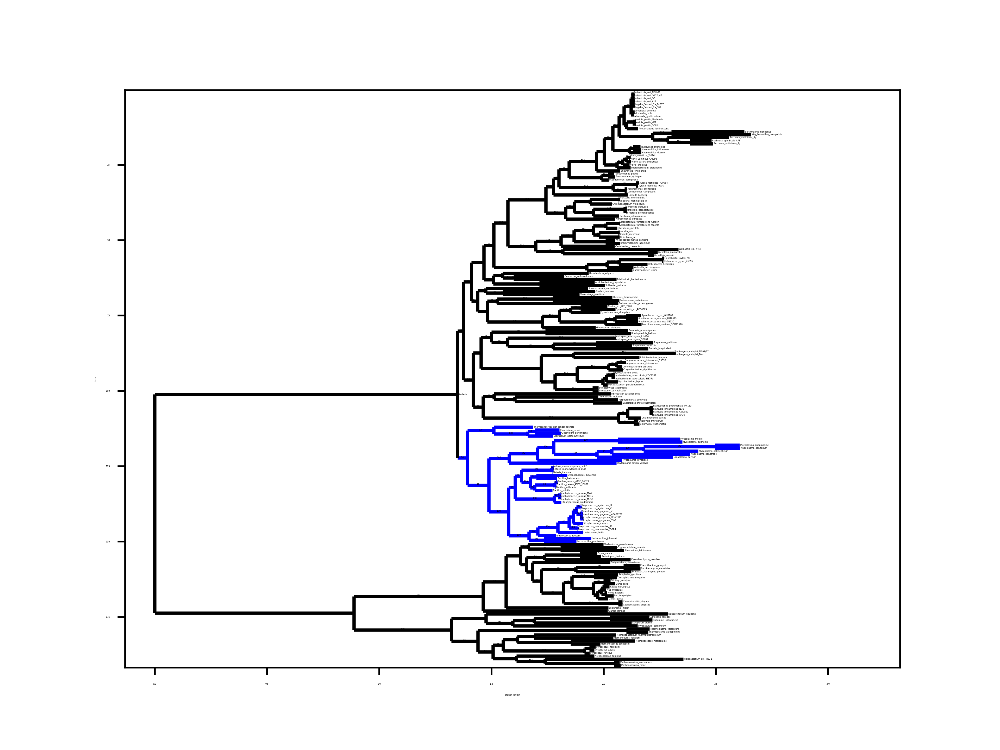
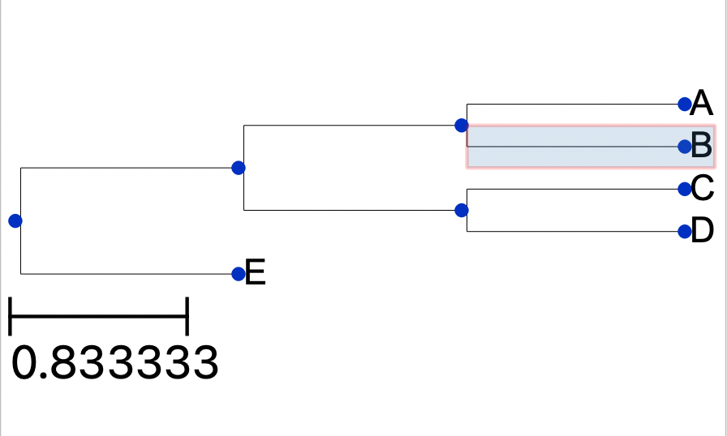
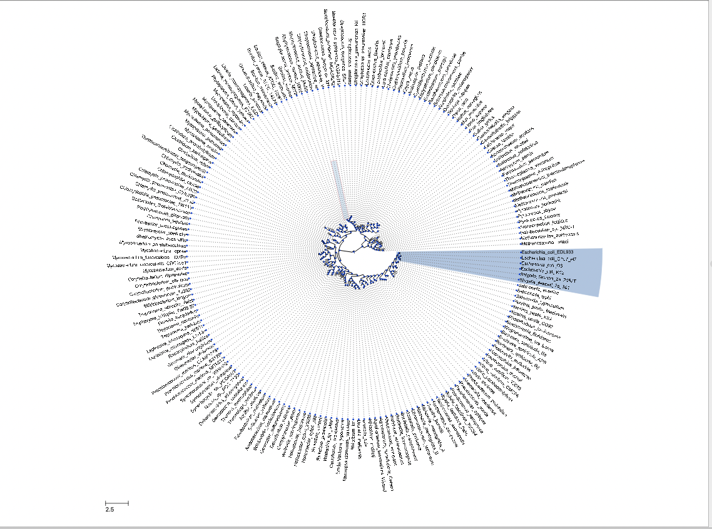
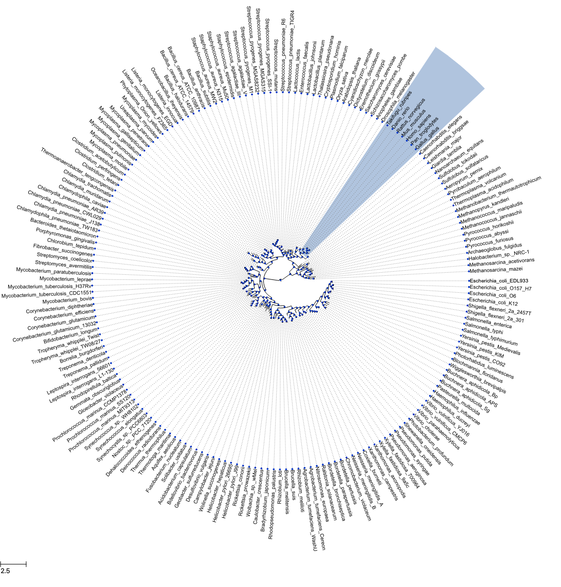
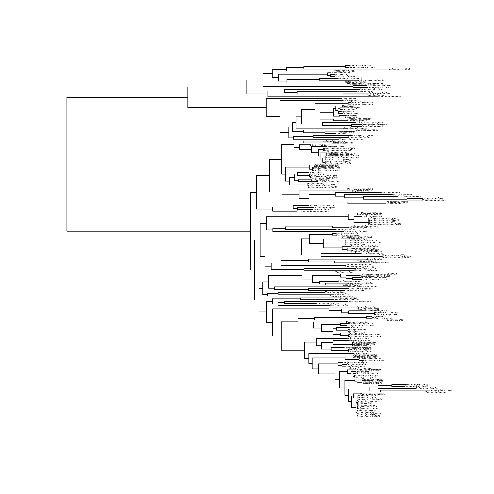
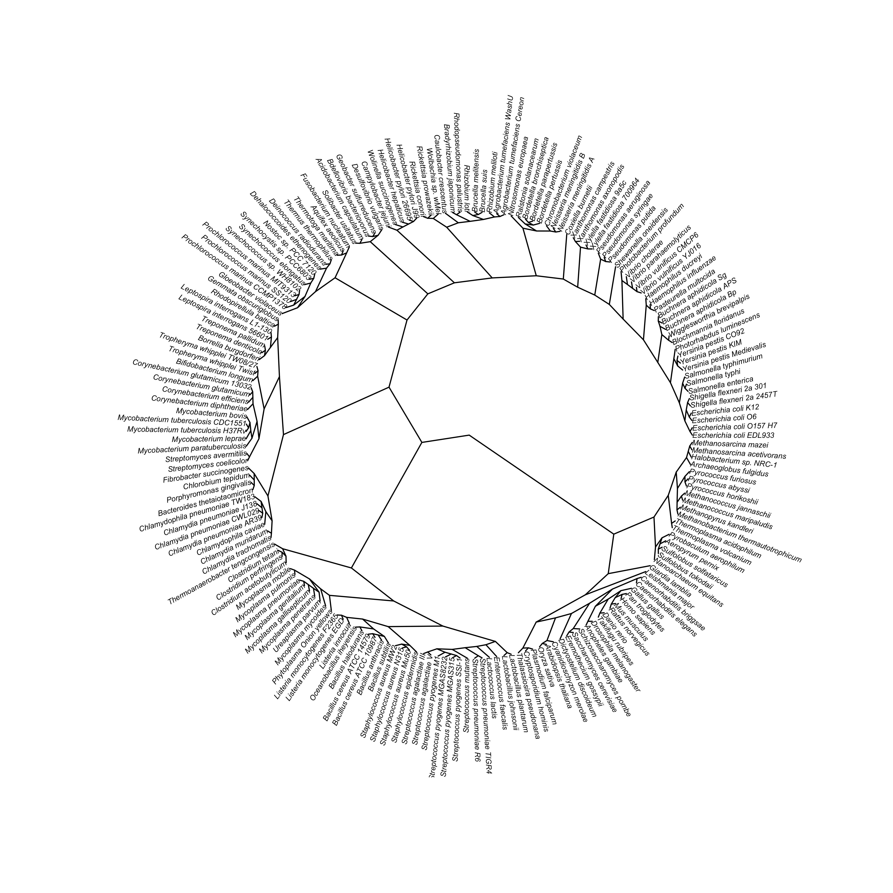
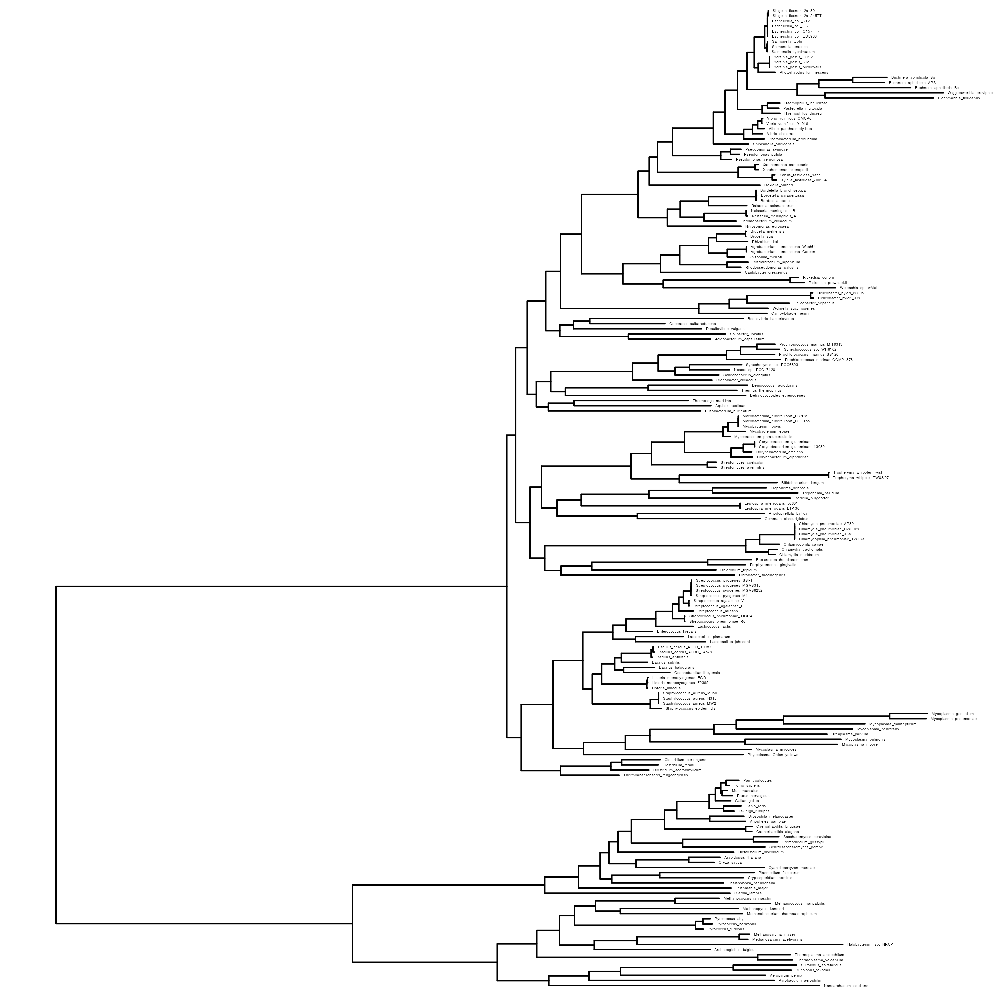
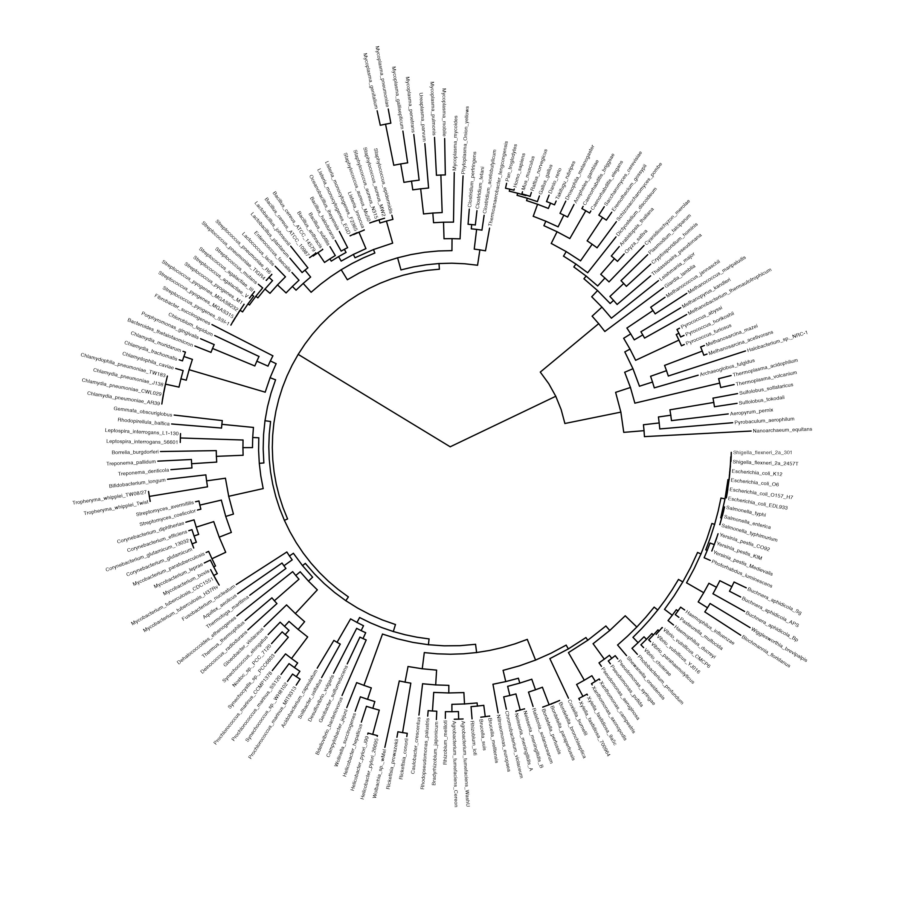

# Отчет по первому филогенетическому практикуму
## Создание филогенетических деревьев в R и Python

### Начнем с Python
1. **Bio::Phylo**  
    Изначально прочитаем дерево с помощью модуля *requests**. После приступаем к отрисовке дерева с псевдографикой *draw_ascii* в консоли. Далее отрисуем дерево и сохраним картинку в трех разных форматах (.png, .pdf, .svg):
```python
# чтение дерева
raw_tree = StringIO(requests.get('https://www.jasondavies.com/tree-of-life/life.txt').text)
tree1 = Phylo.read(raw_tree, "newick")

# отрисовка дерева в консоли 
Phylo.draw_ascii(tree1)

# отрисовка дерева с некоторыми параметрами и окрашиванием выбранной клады
tree1.clade[0, 1].color = "blue"
matplotlib.rc('font', size=1)
matplotlib.pyplot.figure(figsize=(24,12))
Phylo.draw(tree1, do_show = False)

# сохранение дерева в разных форматах
matplotlib.pyplot.savefig("py_tree1_phylo_blue.png", dpi=600)
matplotlib.pyplot.savefig("py_tree1_phylo_blue.pdf", dpi=600)
matplotlib.pyplot.savefig("py_tree1_phylo_blue.svg", dpi=600)
```


2. **ETE3**
    Прочитаем простое дерево (((A,B),(C,D)),E) из текста и сохранием его
    в png формате.

```python
# задаем дерево
simpletree = Tree("(((A,B), (C,D)), E);")
# рисуем дерево
simpletree.show()
# сохраняем полученную картинку
simpletree.render("simpletree.png", w=183, units="mm")
```


    Далее считываем дерево и строим с настройками по умолчанию.
```python
# загружаем дерево
raw_tree = requests.get('https://www.jasondavies.com/tree-of-life/life.txt').text
# отрисовываем дерево
tree2 = Tree(raw_tree, format=1)
tree2.show()
# сохряняем дерево
tree2.render("py_tree2_ete3.pdf")
```
    Теперь отрисуем это же дерево, но в круговом формате и выделим общего предка для Escherichia_coli_EDL933 и Shigella_flexneri_2a_2457T.
```python
# задали дерево и сохранили картинку
circular_style = TreeStyle()
circular_style.mode = "c"
circular_style.scale = 20
tree2.render("py_tree2_ete3_circ.pdf", tree_style=circular_style)

# задаем стиль для выделяемой облости 
nst1 = NodeStyle()
nst1["bgcolor"] = "LightSteelBlue"

# демонстрируем общего предка для двух организмов
n1 = tree2.get_common_ancestor("Escherichia_coli_EDL933", "Shigella_flexneri_2a_2457T")
n1.set_style(nst1)
tree2.show(tree_style=circular_style)
tree2.render("py_tree2_ete3_circ.png", tree_style=circular_style)
```



### Теперь перейдем к R
1. **R::ape**
  Отрисуем простое дерево с помощью стандартной библиотеки *ape*.
```R
# задаем дерево и отрисовываем его
simpletree <- read.tree(text = "(((A,B), (C,D)), E);")
plot.phylo(simpletree)

# сохраняем картинку в разных форматах
png("simpletree.png")
plot.phylo(simpletree)
dev.off()

svg("simpletree.svg", width = 4, height = 4)
plot.phylo(simpletree)
dev.off()
```


Далее прочитаем файл с деревом и отрисуем его, после сохранив в файл png.
```R
# считываем дерево
treeoflife <- read.tree("https://www.jasondavies.com/tree-of-life/life.txt")

# отрисовываем и скачиваем в png формате
png(filename = "treeOfLife.png", width = 20, height = 20, units = "cm", res = 600)
plot.phylo(treeoflife, cex = 0.2)
dev.off()
```


Нарисуем неукорененным и круговым способом.

```R
# неукорененный
plot.phylo(treeoflife, type = "unrooted", no.margin = T)
# сохраним картинку с круговым
png(filename = "treeOfLife_radial.png", width = 20, height = 20, units = "cm", res = 600)
plot.phylo(treeoflife, type = "radial", cex=0.4)
dev.off()
```


2. **R::ggtree**

Теперь воспользуемся другим пакетом R для отрисовки деревьев.
Сперва, нарисуем дерево с минимальными настройками, а после приведем надписи в читаемвый вид. 
```R
# дерево с минимальными настройками
ggtree(treeoflife)
# подкорректированный размер текста
ggtree(treeoflife) + geom_tiplab(size = 1)
# сохраним в png файл
ggsave("ggtree1.png", width=10, height=10)
```


Также отрисуем дерево в круговом формате: 
```R
ggtree(treeoflife) + layout_circular() + geom_tiplab(size = 1) 
# сохраним в файл
ggsave("ggtree2.png", width=10, height=10)
```


Теперь выделим на дереве некоторые организмы (Danio_rerio - красным):
```R
treeoflife <- groupOTU(treeoflife, c("Danio_rerio"))
ggtree(treeoflife) + layout_circular() + 
  geom_tiplab2(size = 2) + geom_tippoint(aes(alpha = group), col = "red") + 
  scale_color_manual(values = c(0,1), aesthetics = "alpha") +
  theme(legend.position = 'null')
ggsave('ggtree3.png')
```
